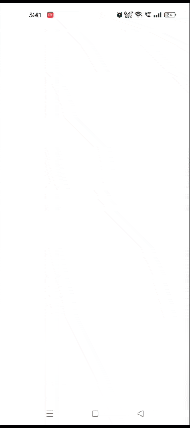
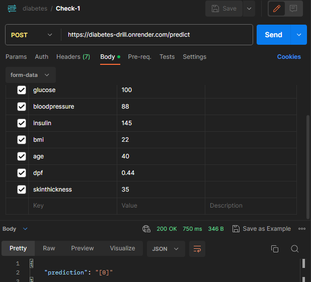

# Diabetes Drill: Your Pocket Diabetes Checker 📊📈

Welcome to **Diabetes Drill** - an Android app that empowers you to take charge of your health using machine learning technology. By combining the prowess of machine learning with the convenience of mobile apps, Diabetes Drill revolutionizes diabetes prediction.

## Why DiabetesPredictor?

🚀 **Swift Predictions**: Instantly receive predictions about the presence of diabetes based on key attributes including age, insulin level, glucose, blood pressure, and BMI.

📊 **Data Insights**: Dive into data-driven insights with interactive visualizations. Explore how different factors contribute to diabetes prediction and gain a deeper understanding of your health.

🔒 **Privacy Matters**: Your privacy is our priority. Rest assured, your personal health information is handled securely and used solely for prediction purposes.

## Technology Stack

Our application's foundation is built on a straightforward and organized technology stack that ensures accurate diabetes predictions:

- **Frontend Development**: The Android app is developed using Java within the Android Studio environment. This approach prioritizes user-friendliness, resulting in an interface that's intuitive and efficient, providing a seamless experience.

- **Backend Infrastructure**: Our backend is developed using Flask, a Python framework known for its simplicity and effectiveness.To ensure the stability and scalability of our backend, it's hosted on the Render platform(free to use).

- **Practical Machine Learning**: At the heart of our app is machine learning. Our model is constructed using industry-standard tools like scikit-learn. This model is shaped by a comprehensive dataset that includes various patient attributes, allowing it to make accurate predictions.

By thoughtfully combining these elements, our technology stack ensures the optimal performance of Diabetes Predictor.

Above is an example of a POST request to our backend. The request body contains the patient's attributes, and the response body contains the prediction.

## Fueling the Prediction

Our model is fueled by an extensive dataset [https://www.kaggle.com/datasets/mathchi/diabetes-data-setfeaturing] data from over 2000 patients. Age, insulin level, glucose, blood pressure, and BMI form the building blocks of accurate predictions. We've fine-tuned the model to offer reliable predictions with minimal false positives.

## The Diabetes Challenge

India faces an alarming diabetes challenge with millions affected. As one of the fastest-growing global epidemics, diabetes impacts individuals and families word-wide. This app addresses a crucial need for accessible and accurate diabetes prediction tools. By harnessing technology and data-driven insights, we aim to empower individuals to make informed decisions about their health.

## Open to Collaboration

We believe in open collaboration to drive positive change. Whether you're a data scientist, app developer, or a healthcare enthusiast, your contributions are valuable. Join us in refining the app, improving the model, and raising awareness about diabetes.

## License

This project is licensed under the [MIT License](LICENSE).

---
